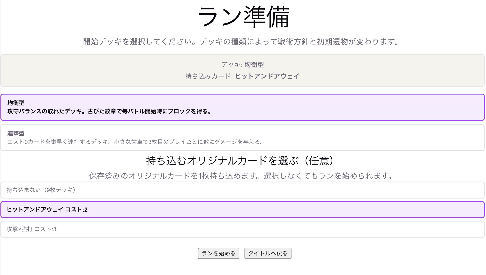
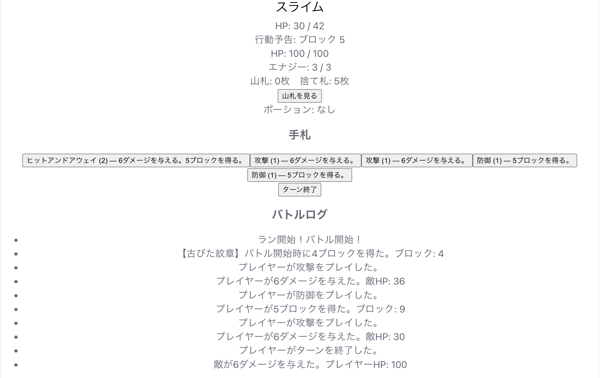
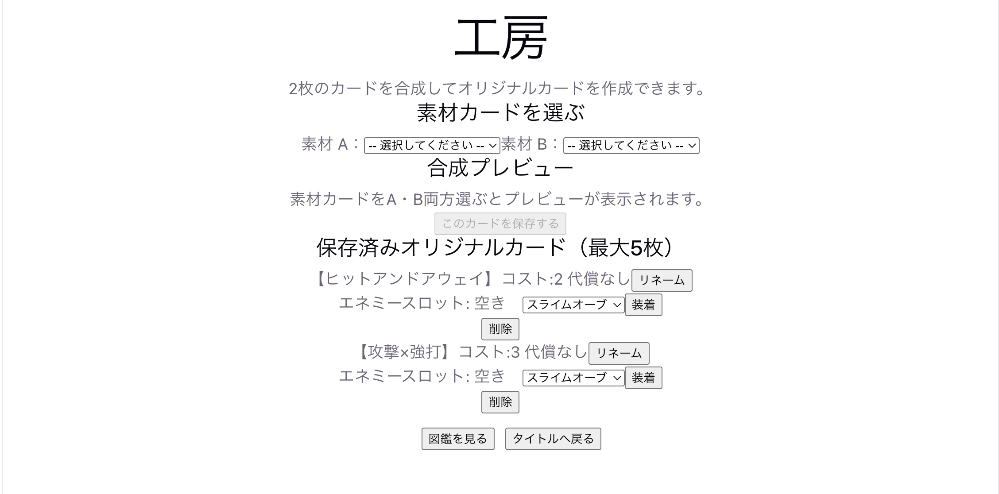

# カードバトル型ローグライク

2枚のカードを合成して作った「オリジナルカード」を切り札に、開始デッキ・敵図鑑・鍛冶を組み合わせて戦うカードローグライク。  
キャラクター選択の代わりに「開始デッキ」でランの戦術方針を選び、敵図鑑を育ててオリジナルカードを強化していく。  
TypeScript + Vite のみで実装したブラウザゲーム。ゲームエンジン不使用。

---

## 開発

このディレクトリ（`roguelike-deck/`）をプロジェクトルートとして扱う。

```bash
npm install
npm run dev
npm test
npm run build
```

---

## デモ・スクリーンショット





---

## MVP について

### MVP 完成基準

- [x] 開始デッキを選択できる（均衡型・連撃型・守護型・侵蝕型）
- [x] 開始デッキごとの初期遺物が機能する
- [x] オリジナルカードを1枚作成できる（素材2枚合成）
- [x] オリジナルカードには空のエネミースロットがある
- [x] 作成したオリジナルカードを初期デッキに入れてランを開始できる
- [x] 敵図鑑ポイントを獲得できる（初遭遇 +10・撃破 +10）
- [x] 図鑑ポイント満タンでエネミーオーブを入手できる
- [x] エネミーオーブをオリジナルカードに装着できる
- [x] カードを使って敵と戦える
- [x] 山札・手札・捨て札が正しく循環する
- [x] 敵が行動予定に従って行動する
- [x] 勝利後にカード報酬を選べる
- [x] ポーションを獲得・使用できる
- [x] マップを移動してボスを撃破できる
- [x] リザルト画面が表示される

### 実装済みフェーズ

| フェーズ  | 内容                                               |
| --------- | -------------------------------------------------- |
| Phase 0–1 | 基礎戦闘ループ（HP・エナジー・ドロー・ブロック）   |
| Phase 2   | 開始デッキ・初期遺物システム                       |
| Phase 3   | オリジナルカード工房（素材合成・エネミースロット） |
| Phase 4   | ラン構造（マップ・報酬・休憩・ボス・リザルト）     |
| Phase 5   | 状態異常・遺物・進化カード・鍛冶・ショップ         |
| Phase 6   | ポーション・消耗品                                 |
| Phase 7   | 敵図鑑・エネミーオーブ・装着UI                     |
| Phase 8   | 実績・試練レベル                                   |
| Phase 9   | タイトル画面・画面遷移リファクタリング             |

---

## 技術スタックと選定理由

| 用途         | 選択                         | 選定理由                                                                                                |
| ------------ | ---------------------------- | ------------------------------------------------------------------------------------------------------- |
| 言語         | TypeScript                   | 型安全なゲームロジック（カード効果・敵行動を Discriminated Union で表現）。`strict: true` で `any` 禁止 |
| ビルド       | Vite                         | 設定レスで即起動。HMR でUIの確認サイクルが速い                                                          |
| レンダリング | DOM（ゲームエンジン不使用）  | ゲームエンジンのオーバーヘッドなし。Canvas 移行を見越してロジックと描画を最初から分離                   |
| テスト       | Node.js built-in test runner | 依存ゼロ。純粋関数が多いロジック層のユニットテストに十分                                                |

---

## 設計の意図

### ロジックと描画の分離

`src/core/` にゲームエンジン非依存のロジック、`src/screens/` にDOM操作のUI制御を置いた。  
将来 ASCII → ドット絵へ移行する際、`Renderer` インターフェースを差し替えるだけで済む設計にした。

```
src/core/   ← GameState を受け取り、新しい GameState を返すだけ（DOM依存ゼロ）
src/screens/ ← GameState を読んで DOM を更新する
```

### GameState はイミュータブルに更新

```typescript
// ✅ スプレッド構文で新しいオブジェクトを返す
return { ...state, player: { ...state.player, hp: newHp } };

// ❌ 直接変更しない
state.player.hp = newHp;
```

テストで副作用なしに前後の状態を比較できる。

### カード効果・敵行動は Discriminated Union

```typescript
type CardEffect =
  | { type: 'attack'; damage: number }
  | { type: 'block'; amount: number }
  | { type: 'draw'; count: number }
  | ...
```

新しい効果を追加したとき、処理漏れをコンパイルエラーで検出できる。

---

## 開発プロセス

このゲームは、私・Claude Code（AI コーディングアシスタント）・友人エンジニアの三者で開発した。

### Claude Code との協働

- **Planner エージェント**：フェーズごとの実装計画を設計
- **Generator エージェント**：TDD ワークフローで実装（テスト→実装→レビュー）
- **Evaluator エージェント**：実装後のコードレビューと品質チェック

`/feature-pipeline` コマンドで「計画 → 実装 → レビュー」のパイプラインを統一した。  
コミットはフェーズ単位で粒度を揃え、`feat(phase5): ...` のような prefix を統一した。

### 友人エンジニアとの共同作業

別分野のエンジニアである友人が、コードを書かない形でプロジェクトに深く関わってくれた。

- **ゲームロジックの設計**：オリジナルカード合成の仕組みや開始デッキのコンセプトなど、ゲームの根幹となるメカニクスをともに考えた
- **実務目線のUIレビュー**：実際の画面を触りながら、ゲームの操作感・UI/UXについてエンジニアとしての実務経験に基づいたフィードバックをくれた

---

## 苦労した点

### 永続化とランの分離

ラン中の状態（`GameState`）と、ラン間で引き継ぐデータ（敵図鑑ポイント・エネミーオーブ・実績）の境界を明確にすること。  
当初は `startRun` に永続データを渡していなかったため、ラン間で図鑑ポイントがリセットされるバグが発生した。

### オリジナルカードの合成ロジック

素材カード2枚の効果を単純に足すと強すぎるため、コスト合計が上限（3）を超えたときに「代償」（自傷・エナジー増加コスト）を自動付与するバランス調整が複雑だった。

### ボス戦の勝敗判定

ボスが自傷ダメージで死亡したとき、プレイヤーの勝利と誤判定するバグがあった。  
`outcome` フィールドを `GameState` に追加して勝敗を明示的に管理する設計に変更した。

### 状態異常の処理順

毒・裂傷・攻撃上昇・攻撃低下が重なった場合のターン開始時処理順（ブロック初期化→状態処理→エナジー回復→ドロー）を仕様として固定し、バトルロジックに一元化した。

---

## 今後の課題

- **コンテンツ拡張**：カード 50 枚・敵 20 種・遺物 30 個・イベント 20 個（現在は各10数種程度）
- **エネミーオーブ追加**：現在1種類のみ。敵ごとに固有のオーブを設計する
- **ドット絵レンダラー**：`PixelRenderer` への移行（ロジック層は既に分離済み）
- **オリジナルカード共有**：作成したオリジナルカードをURLで共有できる仕組み
- **高度なマップ生成**：分岐ルートのある地図構造（現在は縦型一本道）
- **真ボス**：試練レベル最高難度のやりこみコンテンツ
- **itch.io リリース**：ビルド・デプロイフロー整備
