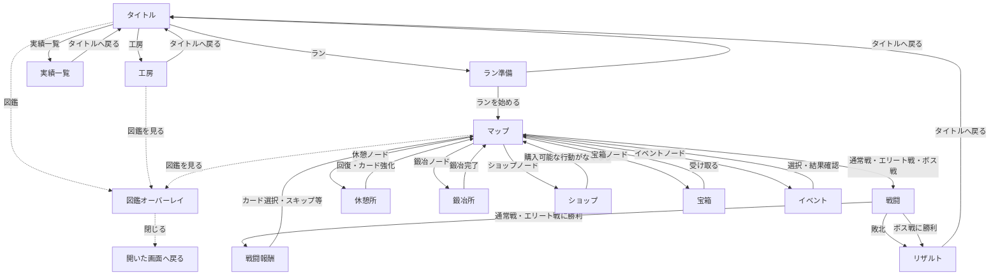

# 現行画面遷移・画面一覧

> 2026-06-27 時点の実装をもとにした簡易資料。図鑑は独立画面ではなく、タイトル・工房・マップの上に重なるオーバーレイとして表示される。

## 画面遷移図

※ 図鑑の点線は、元画面の上に重なって開くことを表す。ショップは「戻る」ボタンを持たず、購入できる行動がなくなった時点で自動的にマップへ戻る。

## 画面ごとの表示・操作

| 画面 | 主な表示 | 主なボタン・操作 |
| --- | --- | --- |
| タイトル | ゲームタイトル | 「ラン」「工房」「実績一覧」「図鑑」 |
| 工房 | 素材カードA・B、合成プレビュー、カード名、保存済みオリジナルカード、エネミースロット | 素材選択、保存、リネーム、削除、オーブ装着／取り外し、「図鑑を見る」「タイトルへ戻る」 |
| 実績一覧 | 解放済み実績の名前・説明、未解放実績 | 「タイトルへ戻る」 |
| 図鑑 | 敵名、図鑑ポイント、オーブ入手状況、登録済みカード | 「閉じる」 |
| ラン準備 | 選択中の開始デッキ・持ち込みカード、開始デッキの説明、試練レベル | 開始デッキ選択、オリジナルカード選択、試練レベル選択、「ランを始める」「タイトルへ戻る」 |
| マップ | 所持ゴールド、クリア済み部屋数、ノードを結ぶマップ | 次に進めるノードを選択、「図鑑を見る」 |
| 戦闘 | 敵のHP・ブロック・行動予告、プレイヤーのHP・ブロック・エナジー、山札／捨て札枚数、手札、ポーション、ゴールド、遺物、バトルログ | 手札のカードを使用、敵をターゲット、ポーション使用、「山札を見る」「捨て札を見る」「ターン終了」 |
| 戦闘報酬 | 撃破した敵、獲得ゴールド、カード候補、ポーション／遺物報酬、オーブ解放通知 | カードを1枚選択、ポーション／遺物を受け取る、「スキップ」 |
| 休憩所 | 現在HP、強化可能なカード | 「HPを回復する」「カードを強化する」、強化対象カードを選択 |
| 鍛冶所 | 空きスロットを持つカード、付与効果候補、所持遺物、変換結果 | 「カード鍛冶」「遺物変換」、対象選択、鍛冶／変換確定、「マップへ戻る」 |
| ショップ | 所持ゴールド、販売中のカード・遺物・ポーション、カード削除候補 | 購入する品または削除するカードを選択 |
| 宝箱 | 入手できる遺物の名前・説明 | 「受け取る」 |
| イベント | イベント名・説明・選択肢、解決後の結果 | 選択肢、「確認して進む」「次へ進む」 |
| リザルト | GAME CLEAR／GAME OVER、選択デッキ、与ダメージなどのラン統計、新規解放実績 | 「タイトルへ戻る」 |
